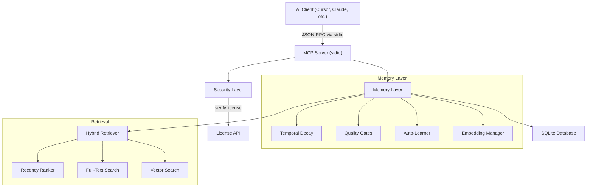

# Cortex MCP — Persistent AI Memory

[](https://www.npmjs.com/package/cortex-mcp)
[](https://www.npmjs.com/package/cortex-mcp)
[](https://github.com/jaswanthkumarj1234-beep/cortex-mcp/actions/workflows/ci.yml)
[](https://opensource.org/licenses/MIT)
[](https://nodejs.org/)

> Give your AI coding assistant a brain that remembers across sessions.

Cortex is an MCP (Model Context Protocol) server that provides persistent, intelligent memory to any AI coding assistant — Cursor, Claude Code, Windsurf, Cline, or any MCP-compatible tool.

## The Problem

Every time you start a new conversation, your AI assistant forgets everything:
- Coding conventions you already explained
- Bugs you already fixed
- Decisions you already made
- What files you were working on

**Cortex solves this.** It stores, ranks, and proactively recalls context so your AI never starts from zero.

## Quick Start

### Option 1: npm install (recommended)
```bash
npm install -g cortex-mcp
```

Then add to your MCP config:
```json
{
  "mcpServers": {
    "cortex": {
      "command": "cortex-mcp",
      "transportType": "stdio"
    }
  }
}
```

### Option 2: Clone from source
```bash
git clone https://github.com/jaswanthkumarj1234-beep/cortex-mcp.git
cd cognitive-memory
npm install
npm run build
```

Then add to your MCP config:
```json
{
  "mcpServers": {
    "cortex": {
      "command": "node",
      "args": ["<path-to>/cognitive-memory/dist/mcp-stdio.js"],
      "transportType": "stdio"
    }
  }
}
```

Restart your IDE and Cortex is active.

### Option 3: Direct Download (Binaries)
No Node.js required. Download from the latest release:
- [Windows](https://github.com/jaswanthkumarj1234-beep/cortex-mcp/releases/latest/download/cortex-win.exe)
- [macOS](https://github.com/jaswanthkumarj1234-beep/cortex-mcp/releases/latest/download/cortex-macos)
- [Linux](https://github.com/jaswanthkumarj1234-beep/cortex-mcp/releases/latest/download/cortex-linux)

Then configure your MCP client to run the executable directly.

## Features

### 16 MCP Tools
| Tool | Purpose |
|---|---|
| `force_recall` | Full brain dump at conversation start (14-layer pipeline) |
| `recall_memory` | Search memories by topic (FTS + vector + graph) |
| `store_memory` | Store a decision, correction, convention, or bug fix |
| `quick_store` | One-liner memory storage with auto-classification |
| `auto_learn` | Extract memories from AI responses automatically |
| `scan_project` | Scan project structure, stack, git, exports, architecture |
| `verify_code` | Check if imports/exports/env vars actually exist |
| `verify_files` | Check if file paths are real or hallucinated |
| `get_context` | Get compressed context for current file |
| `get_stats` | Memory database statistics |
| `list_memories` | List all active memories |
| `update_memory` | Update an existing memory |
| `delete_memory` | Delete a memory |
| `export_memories` | Export all memories to JSON |
| `import_memories` | Import memories from JSON |
| `health_check` | Server health check |

### 14-Layer Brain Pipeline

Every conversation starts with `force_recall`, which runs 14 layers:

| Layer | Feature |
|:---:|---|
| 0 | Session management — track what you're working on |
| 1 | Maintenance — decay old memories, boost corrections, consolidate duplicates |
| 2 | Attention focus — detect debugging vs coding vs reviewing |
| 3 | Session continuity — resume from where you left off |
| 4 | Hot corrections — surface frequently-corrected topics |
| 5 | Core context — all corrections, decisions, conventions, bug fixes |
| 6 | Anticipation — proactive recall based on current file |
| 7 | Temporal — what changed today, yesterday, this week |
| 8 | Workspace git — branch, recent commits, diffs |
| 8.5 | Git memory — auto-capture commits + detect file changes |
| 9 | Topic search — FTS + confidence decay + causal chain traversal |
| 10 | Knowledge gaps — flag files with zero memories |
| 11 | Export map — show all available functions/classes (anti-hallucination) |
| 12 | Architecture graph — show layers, circular deps, API endpoints |

### Cognitive Features
- **Confidence decay** — old unused memories fade, frequently accessed ones strengthen
- **Attention ranking** — debugging context boosts bug-fix memories, coding boosts conventions
- **Contradiction detection** — new memories automatically supersede conflicting old ones
- **Memory consolidation** — similar memories merge into higher-level insights
- **Cross-session threading** — related sessions link by topic overlap
- **Learning rate** — topics corrected 3+ times get CRITICAL priority

### Performance & Reliability
- **Latency**: <1ms average recall time (local SQLite + WAL).
- **Throughput**: 1800+ ops/sec (verified via Soak Test).
- **Stability**: Zero memory leaks over sustained operation.
- **Protocol**: Full JSON-RPC 2.0 compliance (passed E2E suite).

### Anti-Hallucination
- Deep export map scans every source file for all exported functions, classes, types
- When AI references a function that doesn't exist, `verify_code` suggests the closest real match
- Architecture graph shows actual project layers and dependencies

## Optional: LLM Enhancement

Cortex works fully without any API key. Optionally, add an LLM key for smarter memory extraction:

```bash
# Option 1: OpenAI
set OPENAI_API_KEY=sk-your-key

# Option 2: Anthropic
set ANTHROPIC_API_KEY=sk-ant-your-key

# Option 3: Local (Ollama, free)
set CORTEX_LLM_KEY=ollama
set CORTEX_LLM_BASE_URL=http://localhost:11434
```

## Memory Types

| Type | Use For |
|---|---|
| `CORRECTION` | "Don't use var, use const" |
| `DECISION` | "We chose PostgreSQL over MongoDB" |
| `CONVENTION` | "All API routes start with /api/v1" |
| `BUG_FIX` | "Fixed race condition in auth middleware" |
| `INSIGHT` | "The codebase uses a layered architecture" |
| `FAILED_SUGGESTION` | "Tried Redis caching, too complex for this project" |
| `PROVEN_PATTERN` | "useDebounce hook works well for search inputs" |

## Architecture

```
src/
├── server/          # MCP handler (14-layer pipeline) + dashboard
├── memory/          # 17 cognitive modules (decay, attention, anticipation, etc.)
├── scanners/        # Project scanner, code verifier, export map, architecture graph
├── db/              # SQLite storage, event log
├── security/        # Rate limiter, encryption
├── hooks/           # Git capture
├── config/          # Configuration
└── cli/             # Setup wizard
```

## Pricing & Features

Cortex is open core. The basic version is free forever. To unlock deep cognitive features, upgrade to PRO.

| Feature | FREE (npm install) | PRO ($9/mo) |
|---|:---:|:---:|
| **Memory Capacity** | 20 memories | ∞ Unlimited |
| **Brain Layers** | 3 (Basic) | 14 (Full) |
| **Project Scan** | Yes | Yes |
| **Verify Code** | Yes | Yes |
| **Auto-Learn** | No | Yes |
| **Export Map (Anti-Hallucination)** | No | Yes |
| **Architecture Graph** | No | Yes |
| **Git Memory** | No | Yes |
| **Confidence Decay** | No | Yes |
| **Contradiction Detection** | No | Yes |

### Activate PRO
1. Get a license key from your [Cortex AI Dashboard](https://cortex-website-theta.vercel.app/dashboard)
2. Set it in your environment:
   ```bash
   # Option A: Environment variable
   export CORTEX_LICENSE_KEY=CORTEX-XXXX-XXXX-XXXX-XXXX

   # Option B: License file
   echo CORTEX-XXXX-XXXX-XXXX-XXXX > ~/.cortex/license
   ```
3. Restart your IDE / MCP server.

## Architecture



## FAQ / Troubleshooting

<details>
<summary><strong>Cortex doesn't start or my AI client can't connect</strong></summary>

1. Make sure Node.js >=18 is installed: `node --version`
2. Try running manually: `npx cortex-mcp` — check stderr for errors
3. Check if another Cortex instance is running on the same workspace
4. Delete the cache and restart: `rm -rf .ai/brain-data`
</details>

<details>
<summary><strong>Memories aren't being recalled</strong></summary>

1. Confirm your AI client's system prompt includes the Cortex rules (run `cortex-setup` to install them)
2. Check the dashboard at `http://localhost:3456` to see stored memories
3. Verify memories exist: the AI should call `force_recall` at conversation start
</details>

<details>
<summary><strong>"better-sqlite3" build errors on install</strong></summary>

`better-sqlite3` requires a C++ compiler:
- **Windows**: Install [Visual Studio Build Tools](https://visualstudio.microsoft.com/visual-cpp-build-tools/)
- **macOS**: Run `xcode-select --install`
- **Linux**: Run `sudo apt-get install build-essential python3`
</details>

<details>
<summary><strong>License key not working</strong></summary>

1. Verify the key format: `CORTEX-XXXX-XXXX-XXXX-XXXX`
2. Check your internet connection (license is verified online on first use)
3. Clear the cache: `rm ~/.cortex/license-cache.json`
4. Try setting it via environment variable: `export CORTEX_LICENSE_KEY=CORTEX-...`
</details>

<details>
<summary><strong>Dashboard not loading</strong></summary>

1. Default port is 3456. Check if something else is using it: `lsof -i :3456`
2. Set a custom port: `export CORTEX_PORT=4000`
3. The dashboard URL is shown in your AI client's stderr on startup
</details>

## Contributing

See [CONTRIBUTING.md](CONTRIBUTING.md) for development setup, coding conventions, and the PR process.

## License

MIT
